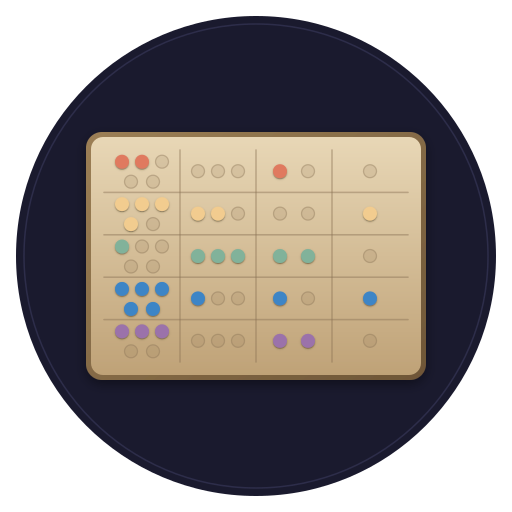

<p align="center">
  
</p>

<h1 align="center">yupana</h1>

<p align="center">
  <em>🧵 Live, per-tenant code structure — the missing structural signal for the Bobbin × Quipu stack</em>
</p>

<p align="center">
  <a href="LICENSE"></a>
  <a href="https://www.rust-lang.org"></a>
  <a href="docs/book/src/SUMMARY.md"></a>
  <a href="docs/yupana-spec.md"></a>
</p>

> *Bobbin holds the thread. Quipu ties the knots. **Yupana** keeps the working coil — live, per-tenant, ready.* 🧶

A [yupana](https://en.wikipedia.org/wiki/Yupana_(textile)) is a coiled skein of yarn
kept ready while you work. **Yupana** keeps a codebase's live structural graph the
same way: extracted once at a baseline, then layered with a lightweight
per-developer overlay so a whole team of humans and agents can edit at the same
time without corrupting each other's view. It answers the questions embeddings
and git-history can't — *what calls this, what does this flow into, what will
this change break* — and it answers them **per tenant**, correctly, while the
code is still in flight.

## 🧶 See It In Action

```text
$ yupana analyze src
analyzed 7 file(s), 47 symbol(s) [tree-sitter]

$ yupana refs authenticate src
src/auth.rs:18 authenticate (Function) [TreeSitter]

$ yupana status
yupana status
  base ref  : main
  tenant    : (single-tenant)
  tiers     : treesitter
  quipu     : enabled=false branch_model=named_graph
```

> **Status:** Phases 1–3 complete. `analyze`, `refs`, `status`, the
> call-graph commands `callers`/`impact` (with `--cochange` reconciliation),
> intra-procedural `dataflow`, and `verify` (the FR-23/FR-24 edit-buffer verdict)
> do real work; an MCP server (`yupana serve`, `--features mcp`) exposes fifteen
> `yupana_*` tools (`yupana_promote` writes to Quipu with the `quipu` feature);
> and the resident daemon (`yupana daemon`) holds the base graph plus
> per-tenant copy-on-write overlays hot, serving code-fact freshness on
> tenant-scoped queries. Around the graph sit the governance planes: the
> pre-edit policy guard (scopes, structural rules, tripwires, and the
> work-item scope ladder), the record-only Bash action surface, session-start
> work-item briefings, the game-state harness (`game-state`), and the
> golden-path conformance guard (`golden-path`, FR-40..FR-42). Promotion lands
> per the [phasing](docs/yupana-spec.md#12-milestones--phasing).

The v0.6.4 installed surface includes both halves of that description. The
structural half is `analyze` / `refs` / `callers` / `impact` / `dataflow` /
`verify`. The change-time policy half is live in `yupana status`: the current
fleet projection reports **7 Quipu-sourced text rules in `advise` mode**. Rules
remain advisory until their own enforcement gates are satisfied. `yupana
exemplar` drafts selector and predicate candidates from a denied example
(policy-by-example); `yupana verifier` exposes the ed25519 public identity used
to bind signed verdicts to the verifier registered in Quipu. Status also says
when the projected rule digest is unsigned, so transport trust is never
misreported as a signed resident cache.

## 🤔 Why Yupana? — and how it's different

Structural code intelligence isn't new; the strongest tools each prove out **one**
signal class. Yupana deliberately takes the best idea from each — then adds the axes
none of them have: **a whole team editing at once, governance, and time.**

### Key selling points

- 🧵 **Correct under concurrency** — the only structural engine that stays right
  while a whole team of humans *and agents* edit the same base at once (shared base
  graph + per-tenant copy-on-write overlays).
- 🔀 **Fusion, not one signal** — call/dataflow structure *plus* historical
  co-change *plus* embeddings. A coupling backed by a dataflow path is real; one
  without is a refactoring smell — only fusion tells them apart.
- 🪢 **Governed & time-travelable** — committed facts promote into
  [Quipu](https://github.com/scbrown/quipu) as SHACL-validated, bitemporal RDF: a
  versioned source of truth, not a best-effort cache.
- 💥 **Blast radius as a primitive** — *"what will this change break,"* per tenant —
  and it doubles as the incremental-update engine.
- ⚡ **Two-tier freshness** — tree-sitter-fast breadth + LSP-precise depth, every
  fact confidence-tagged so an agent knows what it's trusting.
- 🛡️ **Structure scopes the sandbox** — per-tenant blast radius bounds what an
  autonomous agent may touch, and can act as *generation guardrails*, not just context.
- 🪙 **Token-cheap** — structural answers instead of dumping files into context.

### How it compares

| | **codebase-memory** | **Joern (CPG)** | **LSP / multilspy** | **Embeddings / co-change** | **Yupana** |
|---|:--:|:--:|:--:|:--:|:--:|
| Fast structural graph, low token cost | ✅ | ⚠️ | ❌ | ✅ | ✅ |
| Call graph + **dataflow / taint** | ⚠️ | ✅ | ⚠️ | ❌ | ✅ |
| Precise LSP-grade types | tiered | ❌ | ✅ | ❌ | tiered |
| Incremental freshness on edit | ✅ | ❌ | ✅ | ❌ | ✅ *(frontier-bounded)* |
| **Correct while a team edits concurrently** | ❌ | ❌ | ❌ | ❌ | ✅ *(per-tenant overlays)* |
| **Governed, versioned, time-travel record** | ❌ | ❌ | ❌ | ❌ | ✅ *(→ Quipu)* |
| Blast radius scopes an **agent trust boundary** | ❌ | ❌ | ❌ | ❌ | ✅ |

Each proves one piece — **[multilspy](https://github.com/microsoft/multilspy)** that
LSP facts can also be *generation guardrails*, **[Joern](https://joern.io)** the Code
Property Graph and dataflow, **codebase-memory** a lean standalone analyzer with
content-hash incremental freshness. Yupana is spiritually closest to codebase-memory,
extended with Joern-style dataflow, LSP precision, **tenancy**, and a governed
projection into Quipu.

> The moat isn't any single signal — it's **fusion + governance + time + tenancy**,
> kept correct while a whole team edits. No off-the-shelf tool does that.

## 🧩 The Stack — three tools, one job each

```text
        edit / save / file-watch
                 │
                 ▼
   ┌──────────────────────────┐   promote on commit/merge   ┌──────────┐
   │           YUPANA           │ ───────────────────────────► │  QUIPU   │
   │  base graph + overlays   │   (SHACL-validated Turtle)   │ EAVT log │
   │  tree-sitter + LSP + CPG │ ◄─────────────────────────── │ SPARQL   │
   └────────────┬─────────────┘   SPARQL over committed code └──────────┘
                │ blast radius (per tenant)
                ▼
        ┌───────────────┐   broker/Aegis        ┌──────────┐
        │ Bobbin fusion │◄──(trust boundary)────│  agents  │
        │ + serving     │───────────────────────►│ (polecat)│
        └───────────────┘   explained context   └──────────┘
```

- **[Yupana](https://github.com/scbrown/yupana)** (this repo) — extracts and serves
  live per-tenant structure.
- **[Quipu](https://github.com/scbrown/quipu)** — governs and versions the
  committed record (bitemporal RDF / SPARQL / SHACL).
- **[Bobbin](https://github.com/scbrown/bobbin)** — fuses everything with its
  statistical and embedding signals and serves explained context over MCP.

See [`docs/vision.md`](docs/vision.md) for the north star and
[`docs/yupana-spec.md`](docs/yupana-spec.md) for the full build spec.

## 🪢 Yupana + Quipu — what the pair unlocks

Yupana holds the *live* structure; [Quipu](https://github.com/scbrown/quipu) governs
the *committed* record (bitemporal RDF, SHACL-validated, SPARQL-queryable). Together
they do things neither does alone:

- **Governed SPARQL-over-code.** Query committed structure as typed, validated facts
  — *"every public function with no test," "modules that violate the layering," "who
  still calls this deprecated API"* — not a cache you hope is fresh.
- **Impact over history.** Bitemporal facts answer *what did this change break, and
  when did that coupling first appear* — blast radius that accounts for how the code
  got here, replayable at any point in time.
- **Ontology rules that block or influence changes.** Author architectural
  constraints as ontology rules in Quipu (SHACL over the code graph); Yupana evaluates
  a proposed edit against them **live and per tenant**, and warns or blocks a
  violation *before it lands*. Policy-as-ontology — a new rule is a graph assertion,
  not a new bespoke linter.
- **Per-tenant parallel worlds.** A shared base plus copy-on-write overlays (Yupana)
  map onto Quipu named graphs, so a whole team edits concurrently without corrupting
  each other's view — over a single **source-of-truth root** that's always queryable.
- **Agent trust boundaries.** Per-tenant blast radius scopes what an autonomous agent
  may touch — structure *defines the sandbox* — via the Aegis/broker machinery.
- **Code ↔ intent, linked.** Quipu provenance ties structural facts to the decisions
  and work-items that produced them — *"which decision does this module implement,"
  "what tickets co-occur with this code path."*
- **A decidable audit.** Every enforcement decision emits a trace record derived
  from the constraint set itself, plus an ed25519-signed verdict bound to what was
  actually checked. `quipu audit <trace>` then decides `T ⊨ Σ` mechanically —
  without access to the model, its prompts, or its developers. See
  [The Enforcement Trace](docs/book/src/reference/enforcement-trace.md) for the
  record, and [SARC Conformance](docs/book/src/design/sarc-conformance.md) for what
  the pair does and does not yet close.

## 🚀 Quick Start

### Install

```bash
# From source — builds every capability and installs one binary under both names
just install
# ~/.local/bin/yupana
# ~/.local/bin/hank -> yupana
```

### Use

```bash
# Analyze a tree and list its structure
yupana analyze src
yupana refs <symbol> src
yupana status

# Call graph: callers/callees and blast radius
yupana callers <symbol> src
yupana impact <symbol> src --hops 5

# Data dependence within a function
yupana dataflow <function> src --var <variable>

# Export the referential structure (code + docs) as governed RDF Turtle
yupana export src --repo myrepo --format turtle

# Serve over MCP (stdio) for an agent
yupana serve

# Hold the graph resident: base + per-tenant overlays, hot, over local HTTP —
# what makes the sub-100ms guard budget reachable
yupana daemon

# Edit-reactive: wire `yupana hook post-edit` into a Claude Code PostToolUse hook
# for synchronous blast-radius advisories on every edit, and `yupana hook pre-edit`
# into PreToolUse to check an edit against the tenant's scope before it lands.
# `yupana hook session-start` briefs the agent on its tracked work item up front,
# and `yupana hook pre-bash` records (and can guard) the Bash action surface.

# Governance (quipu feature): the verdict-signing identity, and the spool drain
yupana verifier --key-path yupana-signing.pk8   # public key to register in quipu
yupana verdicts --to http://localhost:7878    # promote signed verdicts

# Shell completions
yupana completions bash > yupana.bash
```

Yupana shares the stack's `.bobbin/config.toml` under a `[yupana]` table — see the
[configuration reference](docs/book/src/reference/config.md).

## 🌳 Supported Languages

Tree-sitter structural extraction (symbols, intra-file call edges, import
references — all tagged `TreeSitter`) is wired for Bobbin's full grammar set.
**Rust** is always built; the rest land behind the `langs-extra` feature
(`cargo build --features langs-extra`).

| Language       | Feature       | Extensions                                     |
| -------------- | ------------- | ---------------------------------------------- |
| Rust           | *(always on)* | `.rs`                                           |
| TypeScript     | `langs-extra` | `.ts` `.mts` `.cts` `.js` `.mjs` `.cjs`         |
| TSX / JSX      | `langs-extra` | `.tsx` `.jsx`                                   |
| Python         | `langs-extra` | `.py` `.pyi`                                     |
| Go             | `langs-extra` | `.go`                                           |
| Java           | `langs-extra` | `.java`                                          |
| C / C++        | `langs-extra` | `.c` `.h` `.cc` `.cpp` `.cxx` `.hpp` `.hh` `.hxx` |

Each grammar contributes a per-language `GrammarSpec` (grammar + node-kind →
`SymbolKind` mapping + call/import extraction) to a shared, language-agnostic
walker in `src/extract/`; `language_for_extension` selects the grammar by file
extension. See [FR-1](docs/yupana-spec.md) for the extraction-tier contract.

## 🛠️ Development

```bash
just setup            # install pre-commit hooks
just build            # cargo build
just test             # cargo test
just lint             # clippy -D warnings
just check            # full pre-push gate (fmt, clippy, markdownlint, file size)
just docs build       # build the mdBook
```

Conventions live in [`AGENTS.md`](AGENTS.md); contribution guidance in
[`CONTRIBUTING.md`](CONTRIBUTING.md). Always use `just`, never raw `cargo`.

## 📚 Documentation

- [Specification](docs/yupana-spec.md) — the full PRD-style build spec.
- [Vision](docs/vision.md) — Bobbin × Yupana × Quipu.
- [mdBook](docs/book/src/SUMMARY.md) — guides, concepts, and reference.
- [SARC Conformance](docs/book/src/design/sarc-conformance.md) — the governance
  map across yupana × quipu: what each phase built, and what it did *not* close.
- [The Enforcement Trace](docs/book/src/reference/enforcement-trace.md) — the
  record schema, the attribution tuple and its environment, and the verdict spool.

## License

[MIT](LICENSE) © 2026 Steve Brown
